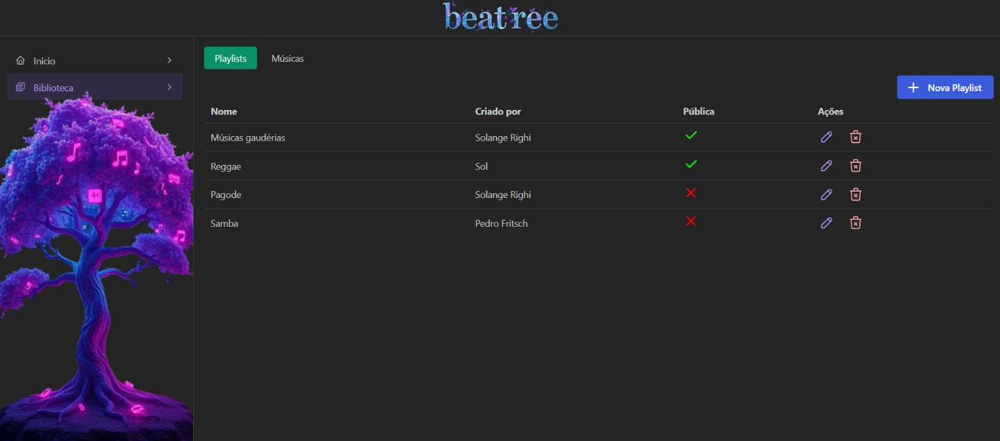
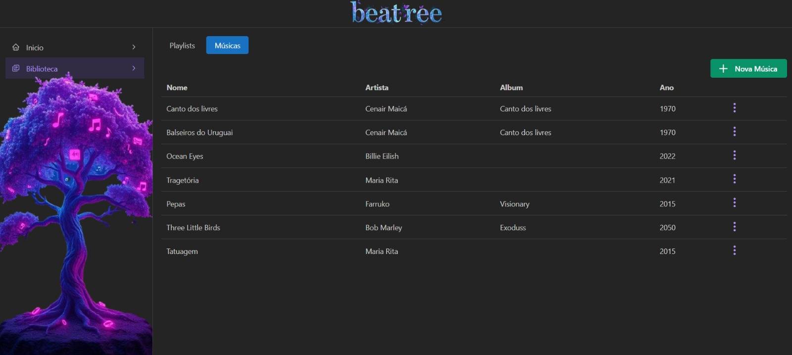
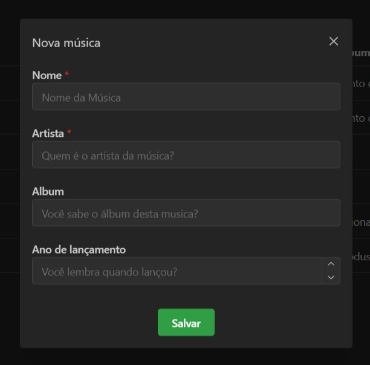
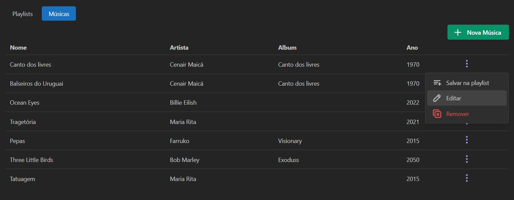
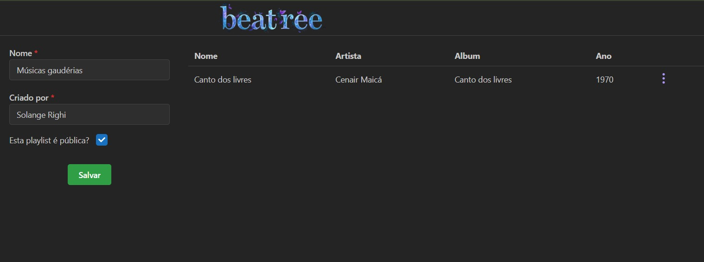

# Beatree Frontend

## Descrição
O Beatree é um projeto de streaming de música com foco no gerenciamento de playlists.O beatree-frontend é o front do projeto Beatree, é a interface da qual o usuário tem acesso para utilizar o projeto.

## Índice
- [Recursos e Funcionalidades](#recursos-e-funcionalidades)
- [Capturas de Tela](#capturas-de-tela)
- [Tecnologias Utilizadas](#tecnologias-utilizadas)
- [Instalação e Configuração](#instalação-e-configuração)
- [Como Contribuir](#como-contribuir)

## Recursos e Funcionalidades
- Gerenciamento de playlists.
- Gerenciamento de músicas.
- Responsividade.
- Git flow.
- Interface amigável e acessível.

## Capturas de Tela






## Tecnologias Utilizadas
React, TypeScript, Next, Mantine

## Instalação e Configuração
```bash
WEB
git clone https://github.com/Solrighi/beatree-front.git)
cd beatree-front
npm install
npm run dev

DOCKER
git clone https://github.com/Solrighi/beatree-front.git)
cd beatree-front
npm install
docker build -t beatree-front .
>docker run -p 3001:3001 beatree-front
```

## Como Contribuir
1. Faça um fork do projeto.
2. Crie uma branch para a sua feature (`git checkout -b feature/nome-da-feature`).
3. Commit suas mudanças (`git commit -m 'Adiciona nova feature'`).
4. Push para a branch (`git push origin feature/nome-da-feature`).
5. Abra um Pull Request.

Colaboradores: 
Dev:
[Solange Righi](https://www.linkedin.com/in/solange-righi/)
